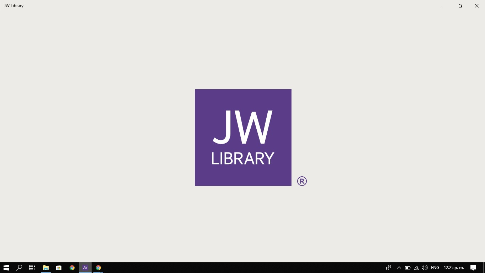
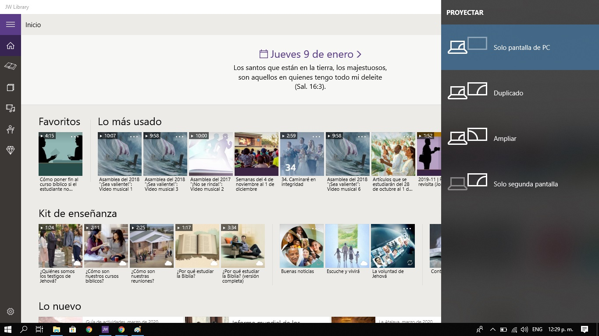
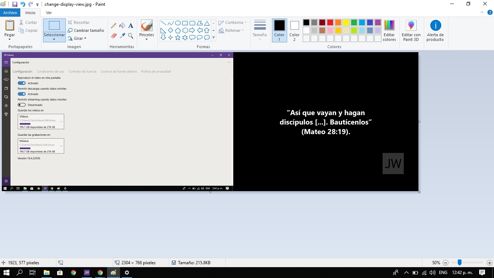

# jw-meeting-helper
A locally running web page which provides the ability to show images and Bible texts in multiple windows.

## How To Get A Screenshot of Year Text
These instructions are for getting a screenshot on Windows 10 with a computer that only has one display (such as a laptop).
1. Open JW Library
   
1. On the keyboard press `Windows`+`P`.
   
1. From this menu select the option for allowing the screen to be extended.
1. In JW Library, go to configurations in the bottom-left corner.
1. Make sure the option for showing videos on the second screen is selected.  If it is already selected turn this option off and then on again.  If this option is not already selected turn it on.
1. Take a screenshot of the entire screen by using the `Print Screen` button on the keyboard.
1. Open the Paint program.
1. Paste the screenshot in Paint by using `Ctrl`+`V`.
   
1. Resize and crop the image to only contain the year text.
1. Save the image as `year-text-####.jpg` in the `Code` folder (of course replacing `####` with the actual year).
1. On the keyboard press `Windows`+`P`.
1. From this menu select the option to only show the the main display.
